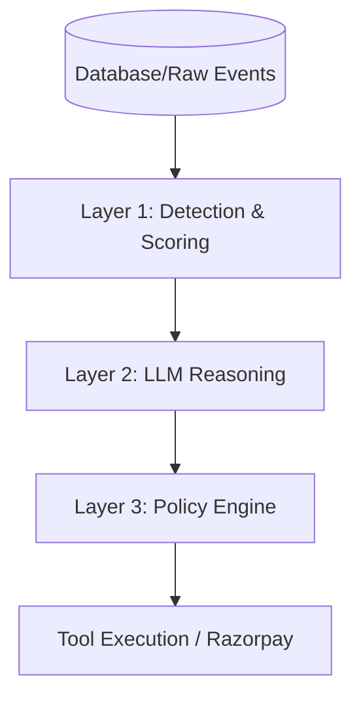

# Revenue Intelligence Agent - System Design Document

This document provides a comprehensive technical breakdown of the **Revenue Recovery Agent** (Opportunity Engine). It details the core architecture, the agentic loop, individual components, and the safety measures in place.

---

## 1. High-Level Architecture

The system is built on a **Three-Layer Safety Model** ensuring that AI reasoning is securely sandboxed between deterministic financial calculations and strict guardrails.

1. **Layer 1 (Detection & Scoring)**: Deterministic code (`scoring-engine.js` & `leak-detectors.js`) scans data for anomalies and calculates financial impact (Revenue at Risk, Recovery Probability).
2. **Layer 2 (Reasoning)**: The LLM (`llm-reasoning.js`) receives structured context, diagnoses root causes, and recommends actions. The LLM does *not* do math or execute code.
3. **Layer 3 (Execution Guardrails)**: The deterministic `policy-engine.js` evaluates the LLM's recommendation against merchant limits (e.g., maximum transaction amount, time-of-day restrictions) before allowing execution via `agent-tools.js`.

---

## 2. The Agentic Loop

The core brain of the system resides in `src/lib/agent-orchestrator.js`. Every time the agent runs, it follows a strict 11-step pipeline.

1. **Observe**: Scans the database using the `detect_revenue_opportunities` tool to find potential revenue leaks.
2. **Detect & Score**: Compares current metrics against a 24-hour baseline. Finds anomalies (e.g., UPI failure spike) and calculates the Priority based on Expected Recovery Value.
3. **Create Opportunity**: Logs a formal "Opportunity" record in the database for tracking.
4. **Investigate**: Sends aggregated, sanitized data to the LLM to diagnose the root cause (e.g., "UPI degradation").
5. **Evaluate**: Calculates the expected recovery for every possible action (Payment Link vs. Notification vs. Retry).
6. **Recommend**: The LLM compares the options considering the customer profile (e.g., LTV, repeat buyer) and outputs a structured recommendation.
7. **Guard (Policy Check)**: The `policy-engine.js` kicks in. It checks if the action violates any guardrails (kill switch, amount limits, confidence thresholds, allowed contact hours).
8. **Decide**: Based on the policy result and the merchant's Operating Mode (Observe / Review / Autonomous), the system decides whether to execute, queue for approval, or just log it.
9. **Act**: If approved, executes the tool (e.g., `create_payment_link`) via the `razorpay-adapter.js`.
10. **Record**: Logs the entire decision tree into an immutable audit trail (`audit_logs` and `agent_runs`).
11. **Measure**: When the outcome happens (e.g., customer pays), attributes the recovered revenue and updates dashboard metrics.

---

## 3. Core Components (Where Features Exist)

### 3.1. Orchestrator (`src/lib/agent-orchestrator.js`)
- **Role**: The conductor. Runs the agent loop, handles step transitions, logs executions to `agent_runs`.
- **Key Functions**: `executeAgentRun()`, `approveIntervention()`, `simulateRecoveryOutcome()`.

### 3.2. Leak Detectors (`src/lib/leak-detectors.js`)
- **Role**: The eyes. Three independent detectors that parse raw data tables to identify revenue leakage.
- **Detectors**:
  - **Payment Failure Recovery**: Finds anomalies in `payments`. Groups repeat failures or high-value isolated failures.
  - **Cart Abandonment Recovery**: Analyzes `cart_events`. Estimates recovery probability based on customer signals.
  - **Discount Leakage**: Analyzes `discounts`. Flags unnecessary discounts given to highly loyal customers who would have bought anyway.

### 3.3. Scoring Engine (`src/lib/scoring-engine.js`)
- **Role**: The calculator. Strictly deterministic mathematical operations.
- **Key Metrics**: 
  - `calculateRecoveryProbability()`
  - `calculateExpectedRecovery()` (Revenue × Probability × Effectiveness)
  - `detectAnomalies()` (Current vs. Baseline stats).

### 3.4. LLM Reasoning (`src/lib/llm-reasoning.js`)
- **Role**: The analyst. Powered by Google Gemini.
- **Responsibilities**: Generates a structured JSON with `root_cause`, `confidence`, `recommended_action`, `reason`, and `risk_level`.
- **Fallback**: Includes a robust rule-based fallback (`fallbackRootCauseAnalysis`) that operates perfectly if API keys are missing or rate limits are hit.

### 3.5. Policy Engine (`src/lib/policy-engine.js`)
- **Role**: The bouncer. Ensures financial safety.
- **Guardrails Checked**:
  - Kill switch enabled?
  - Action in the allowlist?
  - Confidence ≥ 70%?
  - Amount ≤ Auto-execute limit (e.g., ₹25,000)?
  - Amount > High-value threshold (needs manual approval)?
  - Max retries exceeded?
  - Within allowed contact hours (8 AM - 10 PM)?

### 3.6. Agent Tools (`src/lib/agent-tools.js`)
- **Role**: The hands. A structured registry of tools the agent can execute.
- **Available Tools**:
  - `get_revenue_metrics`, `get_payment_failures`, `get_customer_history`
  - `detect_revenue_opportunities`, `calculate_recovery_options`
  - `create_payment_link`, `send_notification`, `retry_payment`

### 3.7. Razorpay Adapter (`src/lib/razorpay-adapter.js`)
- **Role**: The bridge to the real world.
- **Functionality**: Automatically detects if real Razorpay API keys (`.env.local`) are provided. If yes, it calls real APIs (Test Mode). If no, it transparently mocks the responses. The rest of the agent never knows the difference.

### 3.8. Database (`src/lib/database.js`)
- **Role**: State persistence.
- **Technology**: Embedded SQLite (`better-sqlite3`).
- **Tables**: `merchants`, `customers`, `payments`, `opportunities`, `interventions`, `agent_runs`, `audit_logs`.

---

## 4. Operating Modes

The agent can be configured (via Dashboard) into three distinct modes of operation, controlling how far the agentic loop proceeds autonomously:

1. 👁️ **Observe**: The agent detects leaks, calculates math, and generates LLM recommendations, but **stops**. It logs the recommendation and takes zero action.
2. ⏸️ **Review**: The agent prepares the action (e.g., drafts the payment link) but **blocks execution**. It queues an "Awaiting Approval" intervention for a human merchant to click "Approve" or "Reject".
3. ⚡ **Autonomous**: The agent executes the recommended action immediately without human intervention, **provided it passes all Policy Engine guardrails**. If an amount is too high, it automatically downgrades to "Review".

---

## 5. Security & Traceability

- **No LLM Hallucination Risk in Execution**: Tools are strictly mapped in `agent-tools.js`. LLM outputs are schema-validated. An invalid action name will be rejected.
- **Audit Logging**: Every single decision (detection, reasoning, policy rejection, tool execution) is logged into the `audit_logs` table.
- **Idempotency**: The system checks previous `interventions` to ensure the agent doesn't spam a customer for the same opportunity multiple times.
